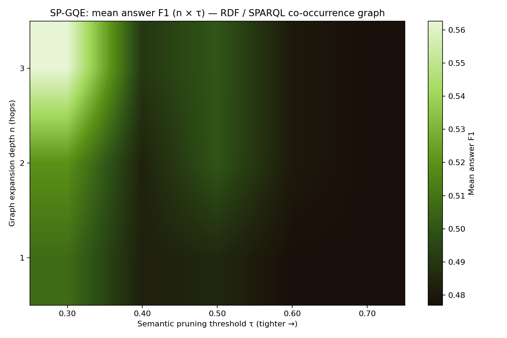
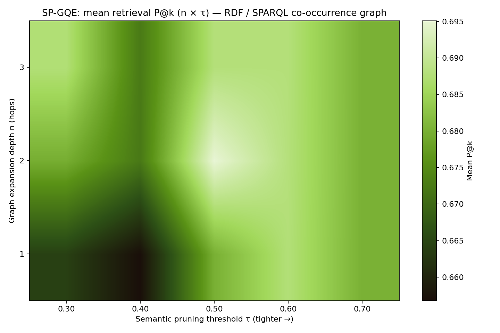

# Experiment run (`--stack plan`)

- **Protocol:** `config\EXPERIMENT_PROTOCOL.md`
- **Hypothesis:** SP-GQE(n=2,τ=0.5) improves mean token F1 vs V-RAG on bridge (multi-hop) questions; comparison subset is secondary.
- **Primary metric:** mean_token_f1; **secondary:** answer_exact_match, supporting_title_recall_at_k

- **Seeds:** [42] (1 runs × 25 questions = 25 instances).
- **Stack (plan):** Groq API `llama-3.1-8b-instant` generation (T=0), `all-MiniLM-L6-v2` embeddings, RDFLib in-memory per-question RDF graph queried via SPARQL 1.1, FAISS.

## Aggregated across seeds (mean ± 95% CI on seed-level means)

| Pipeline | Mean F1 | 95% CI | Mean EM | 95% CI | Mean sup. title recall@k | 95% CI |
|----------|---------|--------|---------|--------|---------------------------|--------|
| V-RAG | 0.5487 | [0.5487, 0.5487] | 0.4400 | [0.4400, 0.4400] | 0.8400 | [0.8400, 0.8400] |
| GQE-RAG(n=2) | 0.6565 | [0.6565, 0.6565] | 0.5600 | [0.5600, 0.5600] | 0.8400 | [0.8400, 0.8400] |
| SP-GQE(n=2,τ=0.5) | 0.5010 | [0.5010, 0.5010] | 0.4400 | [0.4400, 0.4400] | 0.8000 | [0.8000, 0.8000] |
| SP-GQE-i(n=3,τ=0.5) | 0.4823 | [0.4823, 0.4823] | 0.4000 | [0.4000, 0.4000] | 0.7800 | [0.7800, 0.7800] |
| GR-RAG | 0.5373 | [0.5373, 0.5373] | 0.4400 | [0.4400, 0.4400] | 0.8400 | [0.8400, 0.8400] |
| GF-RAG | 0.5175 | [0.5175, 0.5175] | 0.4400 | [0.4400, 0.4400] | 0.8000 | [0.8000, 0.8000] |

## Mechanism test (paired SP-GQE − V-RAG on token F1)

- **Bridge (H1):** mean Δ = 0.0235, bootstrap 95% CI [-0.1746, 0.1976], n = 12
- **Comparison:** mean Δ = -0.1136, bootstrap 95% CI [-0.2747, 0.0000], n = 13

## SP-GQE heatmaps (n × τ) — seed 42 only

## Positioning vs published RAG / GraphRAG systems

| System | Reference | Notes |
|--------|-----------|-------|
| Vanilla RAG (DPR-style dense retriever + reader) | Lewis et al., NeurIPS 2020; follow-up retrieval stacks | Depends on reader; HotpotQA distractor is harder than full-wiki. |
| Microsoft GraphRAG (community summaries) | Edge et al., 2024; msft graphrag | Heavy offline indexing; not directly comparable sample-for-sample. |
| HybGRAG | arXiv:2412.16311 (ACL 2025) | Demonstrates hybrid retrieval > single-modality. |
| SubgraphRAG | ICLR 2025; arXiv:2410.20724 | Trained scorer vs our training-free pruning. |
| RAG vs GraphRAG systematic study | arXiv:2502.11371 (Feb 2025) | Motivates hybrid / query-aware graph use (aligned with SP-GQE). |
| SP-GQE (this work) | Repository experiments | Prototype stack: meant for ablations vs baselines under identical code. |
